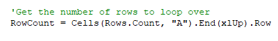
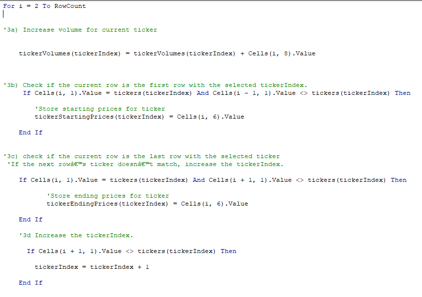
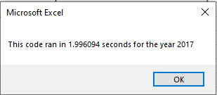
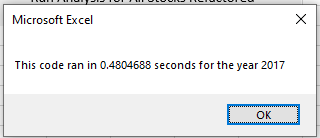
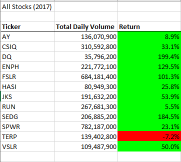
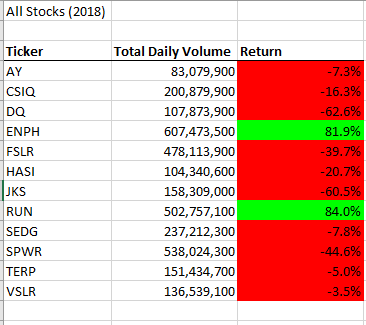

# stock-analysis

# Overview of the Project
- In this project we learned how to refactor our initial VBA code in order to be able to provide Steve with a quicker and more accurate way to be able to analyze a larger data pool of stocks for his parents. By doing this we were able to write code that will also run faster by looping through all the cells of data. With our new module we are able to not only analyze more stocks we are able to format the output to color coordinate a positive or negative gain. I chose to also include a button for the user to be able to easily run the macro and to clear the data sheet.

# Purpose
- The purpose of this project is to provide Steve and his parents a easier way to analyze data to allow them to know which stocks are a good investment. When making investments having information is extremely important and we are providing a way for them to easily read and understand the data in the worksheets. By using our Macro, Steve and his parents will be able to see how all stocks performed in both, 2017 and 2018, with a click of a button. 

# Results 
- In this project we learned how to refactor our code that we used in the modules to better fit the needs for this project. By doing this we were able to write better code that performed faster when dealing with a larger amount of data. The code in the example below is one of the key differences that allowed us to achieve this by allowing our macro to run through all the cells in our spreadsheet, it increased performace and will also provide better scalability. 
-

- As soon in the results below you can also see that our refactored code performed much faster than our original macro. When I run both macros on my computer there is a noticable difference. Running our original macro there is a pause where my computer is loading but with our refactored macro it is almost instant. 

- Orignal macro run time for 2017 sheet

- Refactored macro run time for 2017 sheet

- One of my favorite features in our macro is the formatting of the results when you run the macro. I believe this is extremely important because it makes the data easier to read for Steve and his parents. 

# Summary 

# 1. What are the advantages or disadvantages of refactoring code?
- One of the key advantages of refactoring code is that this allows you to save time instead of writing a script that you have already done over again. When we refactor even though the code will not be exactly the same as before with just some changes you can alter your script to perform the job you need. A disadvantage of refactoring code in my opinion would be that it can be very easy to make a mistake if you are dealing with a lot of lines of code. It is very important to make sure you alter the code correctly for what you need it to do. If not done correctly you can find yourself doing a lot of debugging because something you wrote for another macro might not work.

# 2. How do these pros and cons apply to refactoring the original VBA script?
- One of the complications I overcame while refactoring the original VBA script was that at first I did not change some of the necessary variables to allow our new script to count over all the rows how I wanted. This was causing the new script to only bring over zeros to our output worksheet. This was a learning process because I had to debug the script to find where I made the errors. I believe with the more experince I gain, I will be able to refactor code. The pro of this would be that it definitely did save time and also gave me reference for what I wanted to accomplish. I had to envision and work through the steps needed to do so. 

